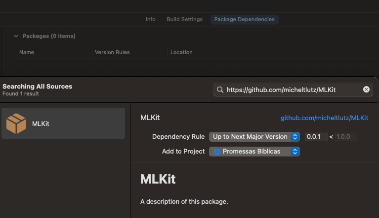

# FaladoresKit

A description of this package.

# Usage

## From Package.swift

```swift
import PackageDescription

let package = Package(
    name: "MyProject",
    products: [
        .library(
            name: "MyProject",
            targets: ["MyProject"]),
    ],
    dependencies: [
        .package(url: "https://github.com/micheltlutz/FaladoreKit", from: "0.0.1")
    ],
    targets: [
        .target(
            name: "MyProject",
            dependencies: ["FaladoreKit"]
    ]
)
```

## From Xcode


