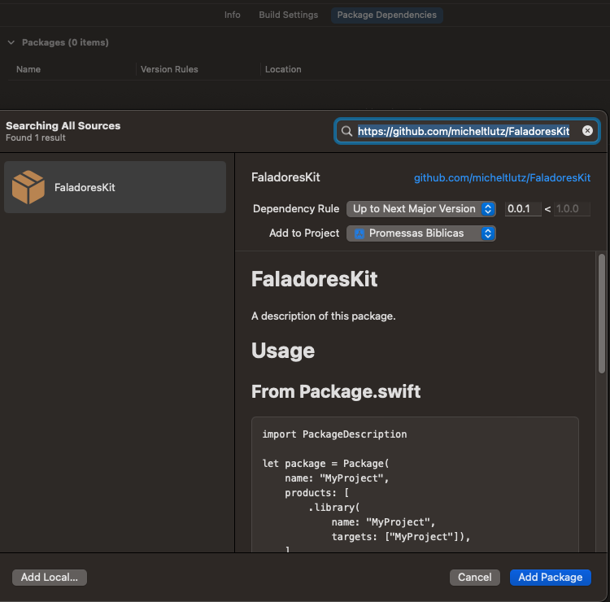

# FaladoresKit


[](https://codebeat.co/projects/github-com-micheltlutz-faladoreskit-develop)
<a href="https://swift.org/package-manager">
      
</a>
[](https://houndci.com)
<a href="https://swift.org">

</a>
------------

Somos dois amigos que gostamos de programar e reunimos utilitários diversos de Swift para facilitar o desenvolvimento de aplicativos que criamos por lazer.


# Faladores

<a 
    data-amt="50" 
    data-since="05/11/22" 
    href="https://github.com/zionix357">
    
</a>
<a 
    data-amt="50" 
    data-since="05/11/22" 
    href="https://github.com/micheltlutz">
    
</a>

# Usage

## From Package.swift

```swift
import PackageDescription

let package = Package(
    name: "MyProject",
    products: [
        .library(
            name: "MyProject",
            targets: ["MyProject"]),
    ],
    dependencies: [
        .package(url: "https://github.com/micheltlutz/FaladoreKit", from: "0.0.1")
    ],
    targets: [
        .target(
            name: "MyProject",
            dependencies: ["FaladoreKit"]
    ]
)
```

## From Xcode


